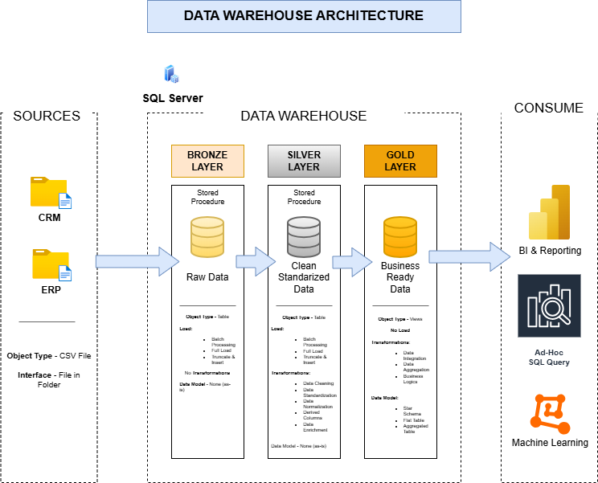

# Data Warehouse and Analytics Project

Welcome to the **Data Warehouse and Analytics Project** repository. 🚀

This project demonstrates the end-to-end implementation of a modern data warehousing and analytics solution, from raw data ingestion to business-ready insights. It showcases industry-standard practices in data engineering, data modeling, and analytics using SQL Server.

---

# 📖 Project Overview

This project includes:

* **Data Architecture:** Designing a modern data warehouse using the Medallion Architecture.
* **ETL Pipelines:** Extracting, transforming, and loading data from multiple source systems.
* **Data Modeling:** Creating fact and dimension tables optimized for analytical workloads.
* **Analytics & Reporting:** Developing SQL-based reports and business insights.

---

# 🚀 Project Requirements

## Building the Data Warehouse (Data Engineering)

### Objective

Develop a modern data warehouse using SQL Server to consolidate sales data and support analytical reporting and business decision-making.

### Specifications

* **Data Sources:** Import data from ERP and CRM systems provided as CSV files.
* **Data Quality:** Cleanse and validate data before loading.
* **Data Integration:** Merge multiple sources into a unified analytical model.
* **Data Model:** Design a user-friendly schema optimized for reporting.
* **Scope:** Focus on the latest available dataset; historical tracking is not required.
* **Documentation:** Provide comprehensive documentation for technical and business users.

---

## 📊 Analytics and Reporting

### Objective

Develop SQL-based analytical solutions that provide insights into:

* Customer Behavior
* Product Performance
* Sales Trends

These insights enable stakeholders to monitor key business metrics and support data-driven decision-making.

---

# 🏗️ Data Architecture

This project follows the **Medallion Architecture** approach, consisting of **Bronze**, **Silver**, and **Gold** layers.



### Bronze Layer

* Stores raw data exactly as received from the source systems.
* Data is ingested from CSV files into SQL Server.
* Preserves source data for traceability and auditing.

### Silver Layer

* Performs data cleansing, standardization, validation, and transformation.
* Resolves data quality issues.
* Creates consistent and reliable datasets.

### Gold Layer

* Contains business-ready data models.
* Implements a star schema optimized for analytics and reporting.
* Serves as the foundation for dashboards and business intelligence.

---

# 📂 Repository Structure

```text
data-warehouse-project/
│
├── datasets/                 # Source CSV files
├── docs/                     # Architecture and documentation
├── scripts/                  # SQL scripts
│   ├── bronze/
│   ├── silver/
│   └── gold/
├── tests/
├── analytics/                # Reporting and analytical queries
├── LICENSE               
└── README.md
```

---

# 🛠️ Tools and Technologies

| Category        | Tools                               |
| --------------- | ----------------------------------- |
| Database        | SQL Server Express                  |
| Query Tool      | SQL Server Management Studio (SSMS) |
| Data Sources    | CSV Files                           |
| Version Control | Git & GitHub                        |
| Diagramming     | Draw.io                             |
| Documentation   | Notion                              |
| Data Modeling   | Star Schema                         |
| Architecture    | Medallion Architecture              |

### Resources

* Dataset files (CSV)
* SQL Server Express
* SQL Server Management Studio (SSMS)
* GitHub Repository
* Draw.io
* Notion Project Documentation

---

# 📈 Business Questions Answered

The analytics layer helps answer questions such as:

* Which products generate the highest revenue?
* Who are the most valuable customers?
* What are the sales trends over time?
* Which regions perform best?
* What customer segments drive business growth?

---

# ⭐ Project Goals

* Build a modern SQL Server data warehouse.
* Implement ETL pipelines.
* Apply data quality and transformation processes.
* Design analytical data models.
* Generate business insights through SQL analytics.
* Demonstrate industry best practices in data engineering and analytics.

---

# 🎯 Skills Demonstrated

This project is ideal for showcasing skills in:

* SQL Development
* Data Warehousing
* Data Engineering
* ETL Development
* Data Modeling
* Data Analytics
* Business Intelligence
* Analytical Reporting

---

# 🤝 Contributing

Contributions, suggestions, and improvements are welcome. Feel free to open an issue or submit a pull request.

---

# 📜 License

This project is licensed under the MIT License. You are free to use, modify, and share this project with proper attribution.
